# TP4 Maëlig LAMARRE M1DEV - Docker Hub

## Introduction

Ce TP a pour objectif de mettre en pratique le déploiement d'une application microservices dans un environnement cloud. Il se décompose en deux exercices : le premier consiste à publier les images Docker de chaque service (authentification, produits, commandes, frontend) sur Docker Hub afin de les rendre accessibles depuis n'importe quel environnement. Le second exercice porte sur le déploiement de l'application complète sur Microsoft Azure, en créant un groupe et un environnement dédiés, en configurant les variables d'environnement nécessaires, puis en déployant chaque service individuellement au sein de cet environnement.

---

Exercice 1 :
Ajout des images sur docker hub (https://hub.docker.com/repository/docker/maelmr/devops-tp4/general) : 
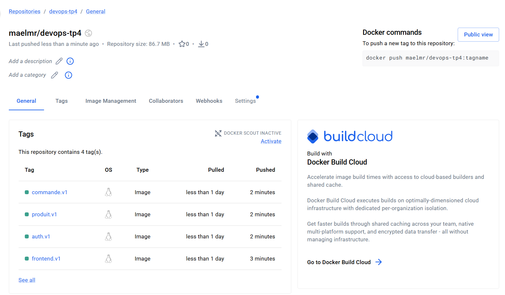

Création de l'application web sur Azure : 
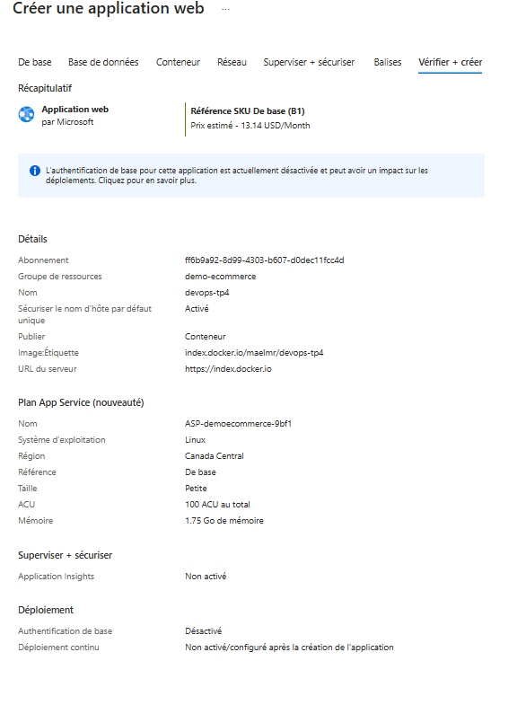

Application crée : 
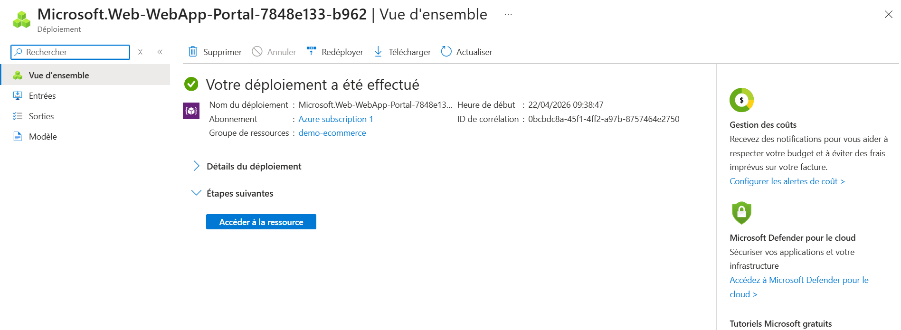

Passage de la variable d'environnement à true : 
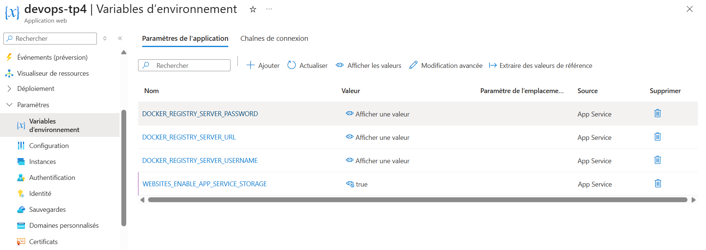

Exercice 2 : 

créer un groupe : 
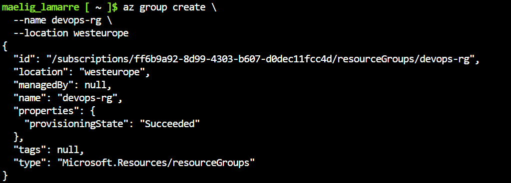

créer un environnement : 
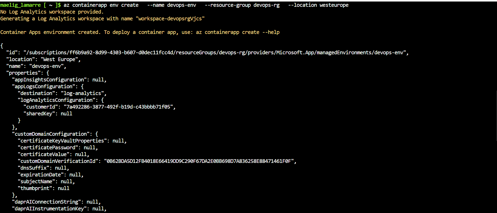

créer les différents services : 
produit : 
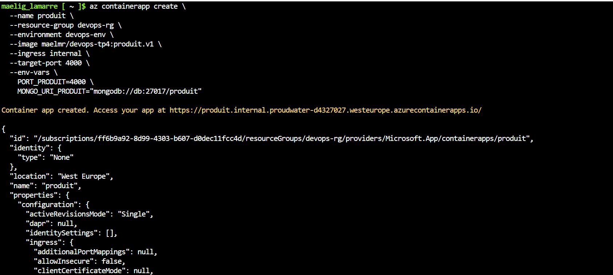
auth : 
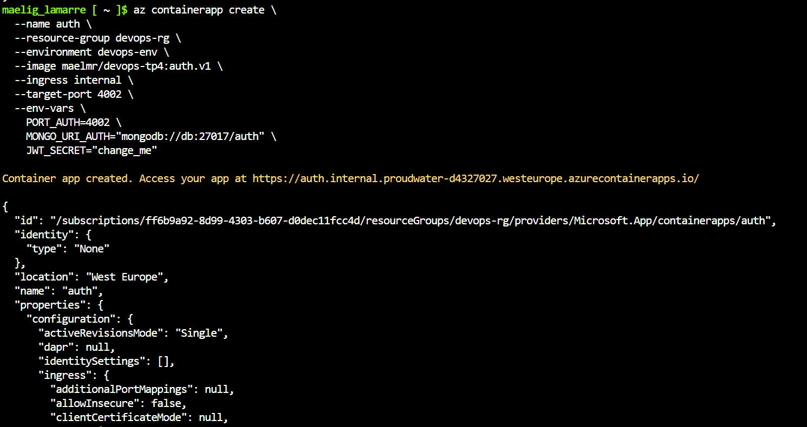
commande : 
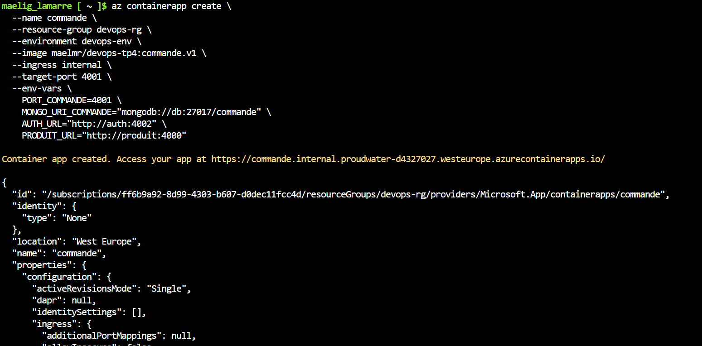
frontend : 
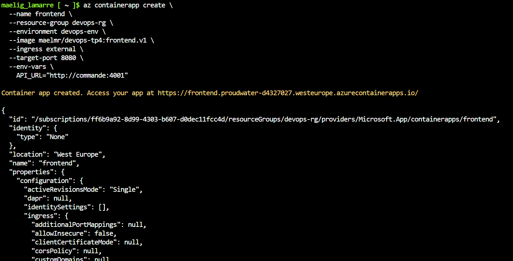
db : 
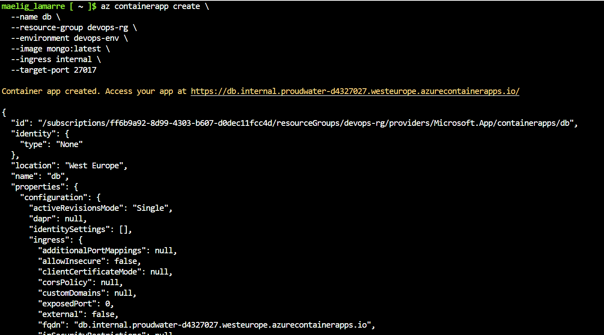

Les applications : 
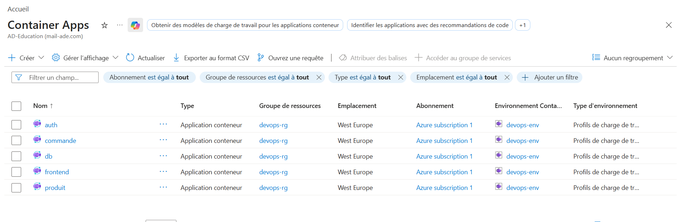

Déploiement des applications : 
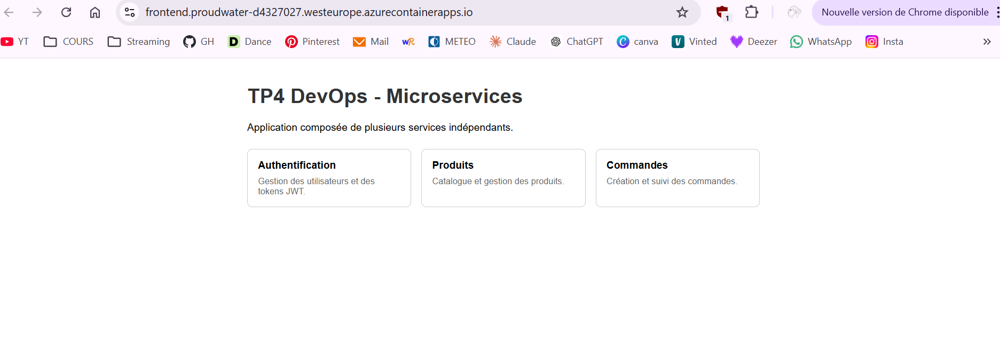

---

## Conclusion

Ce TP m'a permis de comprendre et de mettre en pratique l'ensemble du cycle de déploiement d'une application conteneurisée. J'ai appris à publier des images Docker sur Docker Hub pour centraliser et versionner les images de chaque microservice. J'ai également découvert le déploiement sur Azure, notamment la création d'un groupe et d'un environnement, la gestion des variables d'environnement dans le cloud, et le déploiement indépendant de chaque service. Ce TP m'a donné une vision concrète de ce qu'implique la mise en production d'une architecture microservices dans un contexte DevOps réel.
